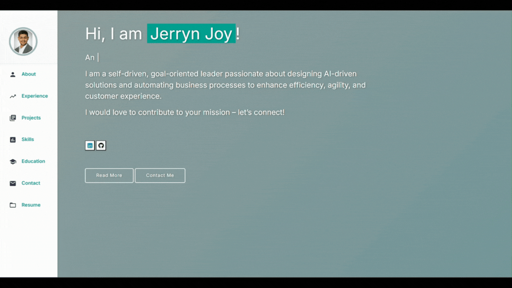

# 🌐 Welcome to My Personal Portfolio

[](https://github.com/jerryn-joy/jerryn-joy.github.io/commits/main)
[](https://jerryn-joy.github.io/)
[](https://www.linkedin.com/in/jerryn-cheenical-joy/)


---

## 🎥 Website Preview

<p align="center">
  <a href="https://jerryn-joy.github.io" target="_blank">
    
  </a>
</p>

---

## 📌 About

This personal portfolio showcases:

- A professional introduction including experience and skills  
- Profile photo  
- Contact information (email, LinkedIn, Xing, phone)  
- Downloadable resume  
- Highlighted projects with GitHub links  

🔗 **Live Portfolio:** [https://jerryn-joy.github.io](https://jerryn-joy.github.io)

---

## 📂 Project Structure

```bash
jerryn-joy.github.io/
├── index.html                     # Main homepage
├── Resume.pdf                     # Resume download
├── README.md                      # This documentation
└── assets/
    ├── css/
    │   └── style.css              # Custom CSS styling
    ├── images/
    │   ├── joy_jerryn_cheenical_photo.webp
    │   ├── Brevo.webp
    │   ├── HubSpot.webp
    │   ├── Hyfindr__logo.webp
    │   ├── make.webp
    │   ├── microsoft-power-automate.webp
    │   ├── n8n.webp
    │   ├── voiceflow.webp
    │   ├── zapier.webp
    │   └── demo.gif               # Preview GIF
    └── vendor/typed.js/
        ├── typed.js
        ├── typed.min.js
        └── typed.min.js.map
```

---

## 🛠️ Technologies Used

- **GitHub Pages** – Hosting the static portfolio  
- **Materialize CSS** – Material Design-inspired UI components  
- **Typed.js** – Dynamic typing animations for a modern touch  

💡 *Design inspired by [Varad Bhogayata's Portfolio](https://varadbhogayata.github.io/)*

---

## 📫 Contact Me

- 📧 **Email:** [jerryn.c.joy@gmail.com](mailto:jerryn.c.joy@gmail.com)  
- 🔗 **LinkedIn:** [linkedin.com/in/jerryn-cheenical-joy](https://www.linkedin.com/in/jerryn-cheenical-joy/)  
- 💼 **Xing:** [xing.com/profile/JerrynCheenical_Joy](https://www.xing.com/profile/JerrynCheenical_Joy)

---

## 🚀 Featured Project

### [AI-Powered Lead Management System](https://github.com/jerryn-joy/Lead-Qualification-Pipeline)

An intelligent, automated pipeline for lead qualification. This project leverages AI to streamline and optimize lead conversion workflows, improving efficiency and accuracy in sales processes.

---
